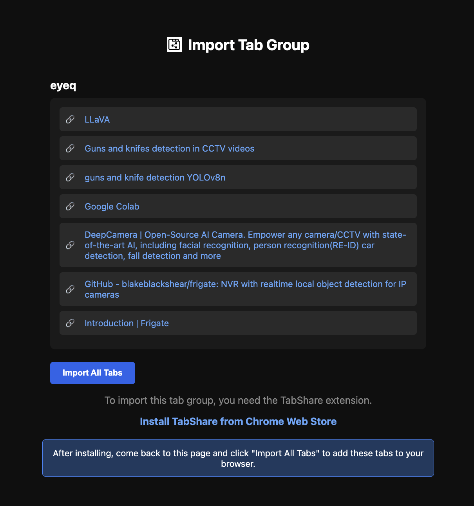

# TabShare – Share Browser Tab Groups via Link

TabShare is a lightweight Chrome / Brave extension that lets you share a browser **tab group** as a link and restore it later.

## crossed 500+ active users!!!

## download [tabshare](https://chromewebstore.google.com/detail/TabShare/ackkgbdepcbjjlbfidccojaodiikiold)

### Extension

### Extension image page

This project was built to understand:
- Chrome extension APIs
- Tab Groups handling
- Browser security boundaries
- Sharing state without a backend

It works locally using **Load unpacked** (no Chrome/Brave Web Store required).

---

## ✨ Features

### Core
- Detects all tab groups in the current window
- Lists tabs inside each group
- One-click share generates and copies a link
- Restores the full tab group from the link
- Works on Chrome and Brave (Chromium-based browsers)

### Share History
- Stores the **last 10 shared tab groups**
- Shows **timestamp** for each shared group
- Quick **copy link** button for history items
- Delete individual history entries
- Prevents duplicate entries in history

---

[privacy policy](https://sidhuachary02.github.io/tabshare-extension/privacy/)